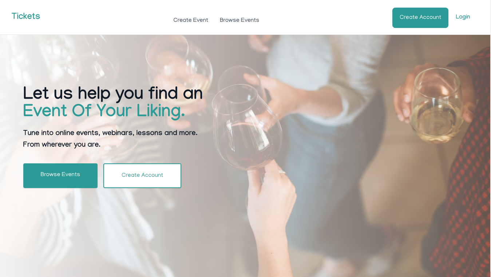
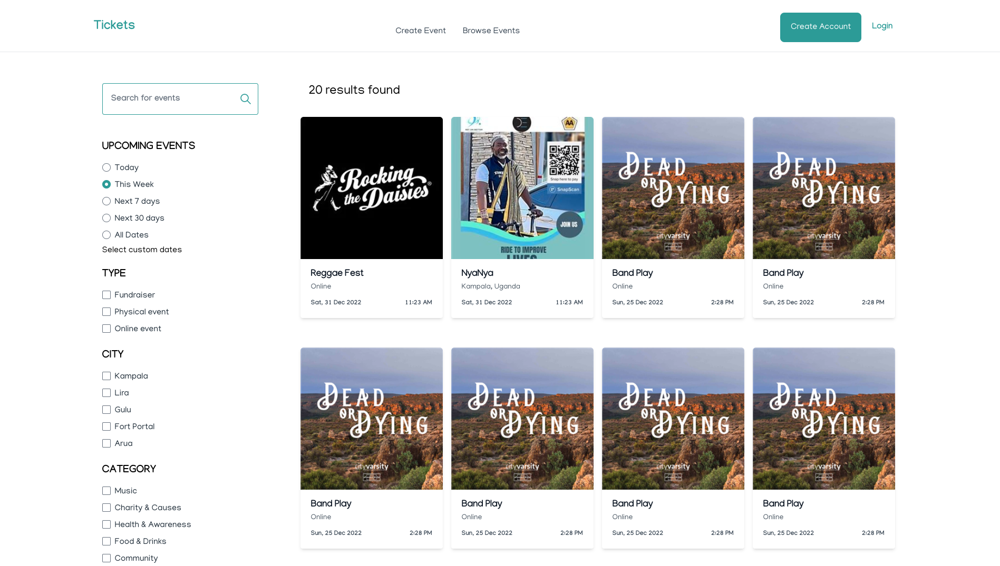
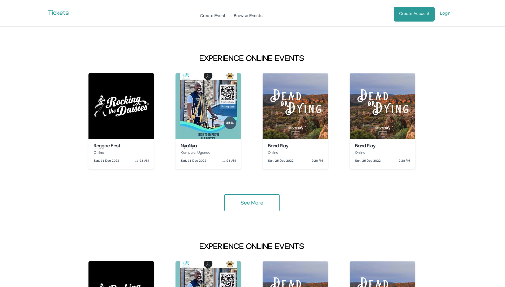

## A fullstack event booking website

Visit the live app: [https://event-ticketss.netlify.app/events](https://event-ticketss.netlify.app/events)

<table>
  <tr>
    <td></td>
    <td></td>
    <td></td>
  </tr>
</table>

### Tools

- Go
- Gorm
- Svelte
- PostgreSQL
- Typescript
- Tailwind CSS
- [render.com](render.com) (For hosting the Go app and database)

### Features

- User and access management
- Pagination
- Database record access
- JWT based auth
